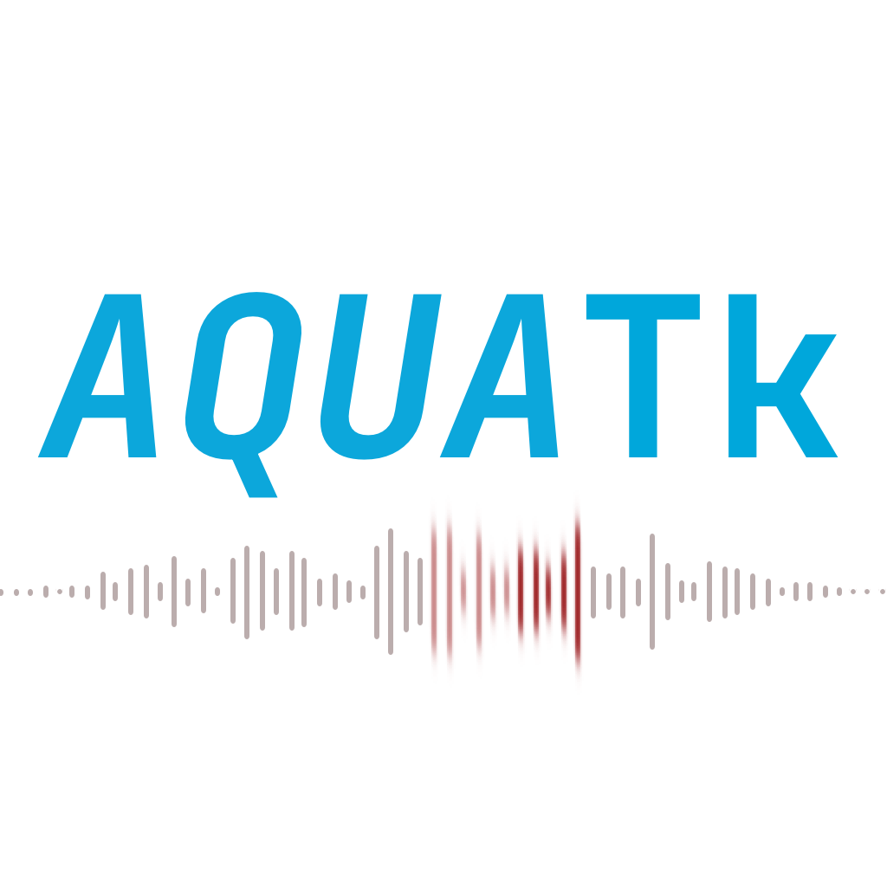

# AquaTK
-----

**Still in development**



AquaTK is short for "Audio QUality Assessment Toolkit". It contains metrics that are popularly used in the evaluation of Neural Audio Synthesizers such as FAD and Kernel Distances. It also contains a pure python port of PEAQb, a C implementation of the Basic PEAQ algorithm. 

Currently implemented metrics: 

| Metric | Description                     |
| ------ |---------------------------------|
| FAD | Frechet Audio Distance          |
| KID | Kernel Inception Distance       |
| PEAQb | Basic PEAQ                      |
| NDB/k | Number of Different Bins over K |
| SISDR | Scale-Invariant SDR             |
| SNR | Signal-to-Noise Ratio           |
| MAE | Mean Absolute Error             |
| MSE | Mean Squared Error              |
| KL | Kullback-Leibler Divergence     |

## Installation

You can install this repo using Git for now. PyPi support is coming soon:
```bash
$ pip install git+https://github.com/ashvala/AQUA-tk.git
```
### Setting up VGGish weights: 

Download The following: 

* [VGGish model checkpoint](https://storage.googleapis.com/audioset/vggish_model.ckpt)
* [Embedding PCA parameters](https://storage.googleapis.com/audioset/vggish_pca_params.npz)

Put them in the `embedding_extractors/vggish` folder. However, as long as you have the files, you can set the paths manually by yourself when initializing the VGGish extractor: 

```py
from aquatk.embedding_extractors import VGGish

vggish_extractor = VGGish(path_to_checkpoint=PATH_TO_CHECKPOINT, path_to_pca_params=PATH_TO_PARAMS)
```

---

## Contributing

Contributions are welcome! Please feel free to open an issue or a pull request. This repository will only improve with your involvement! 

## Acknowledgements 

This package would not exist if it weren't for the following: 

- Frechet Audio Distance on Google Research
- Frechet Audio Distance by @gudgud96
- The Kernel Inception Distance implementation on TorchMetrics
- [PEAQb & PEAQb-Fast](https://github.com/akinori-ito/peaqb-fast)
- [NDB/k by eitanrich](https://github.com/eitanrich/gans-n-gmms/blob/master/ndb_mnist_demo.py)
- VGGish model from [Tensorflow's repo](https://github.com/tensorflow/models/tree/master/research/audioset/vggish)

----

License acknowledgements:

The program generally is released under the GPL license. However, it is important to mention the license for some of these 
models and implementations: FAD and VGGish from Google are provided under the Apache 2.0 license. @gudgud96's implementation 
for FAD is released under MIT license. PEAQb is released under the GPL license. 

----


